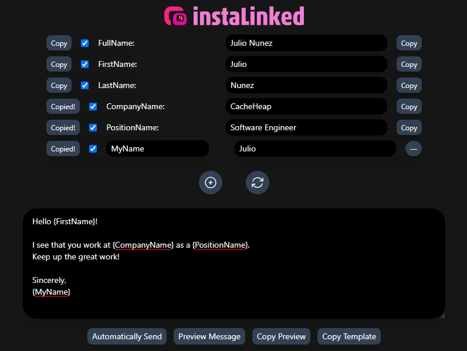
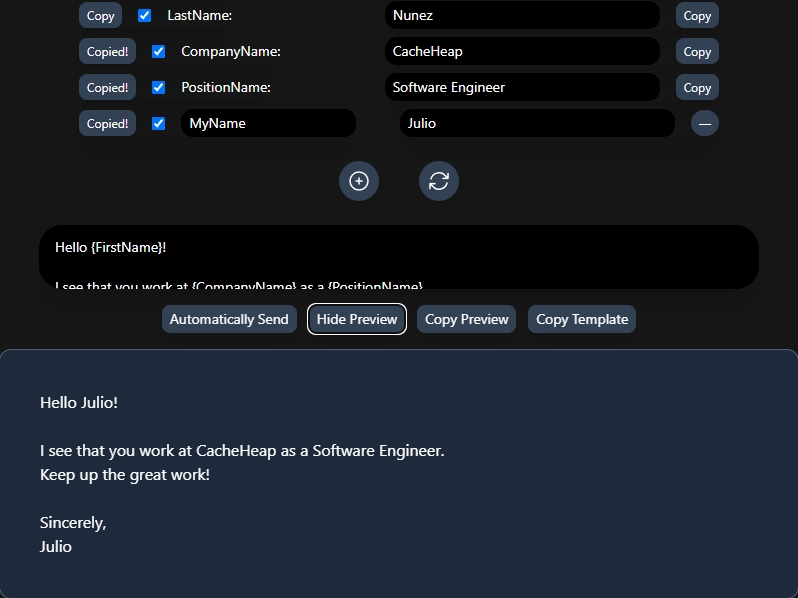

   
   

# instaLinked

instaLinked is a powerful and easy-to-use Chrome extension that helps you automate and personalize connection requests on LinkedIn, making your networking and lead generation efforts more efficient.
 

# Features

Automatically send personalized connection requests on LinkedIn profiles.
Extract relevant data from profiles, such as full name, first name, last name, company name, and position.
Create custom message templates with placeholders for personalized data.
Intuitive and responsive user interface built with Tailwind CSS.
 

# Installation

Download the latest release of the instaLinked Chrome extension.
Extract the downloaded ZIP file to a folder of your choice.
Open Google Chrome, and navigate to chrome://extensions.
Enable "Developer mode" in the top-right corner of the page.
Click "Load unpacked" and select the `dist` folder containing the extension files.
The instaLinked extension should now be installed and ready to use.
 

# Usage

Click the instaLinked icon in your Chrome browser.
Customize the message template by adding placeholders for the extracted data (e.g., {FirstName}, {CompanyName}, etc.).
Navigate to a LinkedIn profile you wish to connect with.
Click the "Auto Send" button to automatically send a personalized connection request, or use the "Copy Preview" and "Copy Template" buttons to copy the generated message for manual use.
 

# Screenshots

## `Opened Extension`

 

  

## `Message Preview`

 

  

# Contributing

Pull requests are welcome. For major changes, please open an issue first to discuss what you would like to change.
 

# License

This project is licensed under the [MIT License](https://choosealicense.com/licenses/mit/).
 
